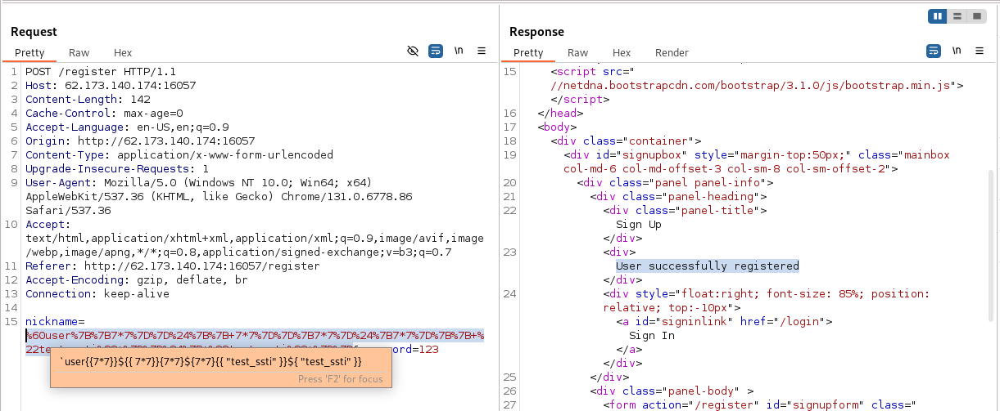

## Bug Bounty-code

Категория: web\
Уровень: Средний

---
### Описание
Описание: Говорят, что здесь можно получить админа без СМС, но с регистрацией, а дальше как?

### Решение

В описание задания есть подсказка, нам нужно стать админом. Предварительно запустим фаззинг ендпоинтов используя ```wfuzz```. Также можно фаззить скрытые файлы, файлы по расширением, хедеры и параметры в известных ендпоинтах, перебирать методы и так далее, сейчас это избыточно.


Открываем Burp Suite и изучаем сервис:


Видим HTTP 302 редирект ```Location: /login```, обращаем внимание на хедеры которые пришли от приклада. Видим хедер ```Server: Werkzeug/3.0.4 Python/3.10.7```, нам это сразу говорит о том, что:
- приклад написан на Python фреймворке
- отсутвует реверс прокси который мог бы фильтровать запросы через mod_security

Видим возможность регистрации пользователя на ендпоинте ```/register```. Регистрируем пользвателя ```user123``` и бегло изучаем сервис и ендпоинты:


### Ендпоинт /login

На странице логина вводит креды тестовой учетки user123 и изучаем полученный ответ:


В ответе видим и изучаем хедер:

```
Set-Cookie: session=eyJpc19hZG1pbiI6ImZhbHNlIiwibmlja25hbWUiOiJ1c2VyMTIzIn0.Z6Ea4g.mmbCo2aDPFQ1J90XER8enMONuuo; HttpOnly; Path=/
```
где параметры:

- ```session=``` это кука которая хранит сессию пользователя, Burp Suite сразу декодит первую часть:

```
{"is_admin":"false","nickname":"user123"}
```

Становится ясно, как приклад понимают ролевую модель админа. Берем это на заметку.

- ```HttpOnly=```, говорит браузеру, что куки не должны быть доступны из JavaScript 

- ```Path``` - указывает, в каком пути (URL-пути) куки будут отправляться обратно на сервер. Если указано Path=/, значит куки будут включаться во все HTTP-запросы к этому домену


### Ендпоинт /

Страница по редактированию заметок, на ней находим заметку от разработчика в base64  виде:


Декодируем base64 и получаем:

```
$ echo IEkgdXBkYXRlZCB0aGUgdXNlciBlbnRpdHkgdmlldy4NCiBtb2RlbCA9IHsNCiAnbmlja25hbWUnOiBuaWNrbmFtZSwNCiAncGFzc3dvcmQnOiBwYXNzd29yZCwNCiAnaXNfYWRtaW4nOiAnZmFsc2UnDQogfQ== | base64 -d

 I updated the user entity view.
 model = {
 'nickname': nickname,
 'password': password,
 'is_admin': 'false'
 }
```

Теперь становится известна сущность пользователя которая используется в бизнес логике приклада.

### Ендпоинт /profile


На странице ```/profile``` присутсвует отображение ролевой модели ```Admin: true/false```, а также есть возможность изменить атрибуты учетной записи: логин и пароль.


### Моделирование и тестирование угроз

#### Account Enumeration and Re-Registration

- Account Enumeration and Re-Registration - атака, в ходе которой злоумышленник компрометирует учетные данные для получения доступа. Иногда в веб прикладе может быть допущена ошибка и отсутсвует или не работает проверка на существующую учетную запись, что позволяет повторно зарегистрировать учетную запись с уже существующим именем пользователя.

Проверка:


1) на стринице ```/register``` пытаемся зерегистрировать пользаветля admin, предпологая, что у него есть права админстратора


2) на странице ```/login``` в куке ```Set-Cookie: session=eyJpc19hZG1pbiI6ImZhbHNlIiwibmlja25hbWUiOiJhZG1pbiJ9.Z6HrYQ.QxAoIDqRyWcs8isbKQpItNz_2Hk; HttpOnly; Path=/``` проверяем парамтер ```is_admin```, получаем ```false```. 

#### Account Takeover

- Account Takeover - это уязвимость, при которой злоумышленник может получить несанкционированный доступ к чужой учетной записи пользователя. Она похожа на Account Enumeration and Re-Registration, но в данном случае атака просходит при смене атрибутов учетной записи (логин, пароль, электронная почта, etc)  без должной проверки прав на внесение таких изменений.


1) Регистриуем двух пользователей ```user1``` и ```user2```.


2) На странице ```/edit``` пользователь ```user1``` попытается изменить логин и пароль для учетной записи ```user2```, при этому в куках у нас сессия ```user1```. Получем 500 ошибку, приклад крашится.

#### Server-side template injection

- Server-side template injection - Python фреймворки используют для шаблонизации используют jinja. Может возникнуть уязвимость, когда пользовательский ввод небезопасно обрабатывается внутри серверного шаблона.



1) на стринице ```/register``` пытаемся зерегистрировать пользаветля ```user{{7*7}}${{ 7*7}}{7*7}${7*7}{{ "test_ssti" }}${ "test_ssti" }}```

2) на странице ```/profile``` проверяем рендер никнейма на возможное исполнение jinja шаблонизации


#### SQL injection

- SQL Injection - в приложении на ендпоинтах которые принимают пользовательский ввод и небезопасно передают его в sql запрос в БД, могут присутсовать sql инъекции:


1) На странице ```/login``` проверим SQL Injection Bypass Authentication логическими запросами ```admin' or 1=1 --``` и ```admin';#--+-```


2) Можно пробовать перебирать руками детект SQL Injection на ендпоинтах с пользовательским вводом /register, /login, /edit. Либо автоматизированные средсва, например, sqlmap. Каких-то артефактов указывающих на SQL Injection не было обнаружено.

3) Перебирать на SQL инъекции можно различные части HTTP-запросов. Ендпоинты, GET праметры, куки, заголовки. Если приклад (реальный пример) используют внешние сущности, например, загружается SSL сертификат и на атрибуты серта завязана бизнес логика с передачай в БД, то paylod может присутсовать в полях ssl сертификата и выполнить инъекцию.

#### Brute-force and craft session cookies

- Brute-force and craft session cookies - приложение на Flask использует cookie которая содержит сессию пользователя, при этом сессия подписана секретным ключом и не зашифрована. Это значит, что можно провести brute-force атаку на ключ и создать свою сессию с нужными атрибутами для модели пользователя.

1) Сессия состоит из ```{ json_data }.{ timestamp }.{ secret_key }```, брутфорс происходит с использованием утилиты ```flask-unsign```:


```
flask-unsign --unsign --no-literal-eval --cookie 'eyJpc19hZG1pbiI6ImZhbHNlIiwibmlja25hbWUiOiJ1c2VyMTIzIn0.Z6JI1w.IHEwtNSAmW4449Q97ZPpJfwQpYc' --wordlist ~/rockyou.txt
```

Атака брутфорса не удается.

2) Также если приклад написан с ошибками, то возможно в нем не проверятся подпись для ```{ json_data }.{ timestamp }```:


```
flask-unsign --sign --cookie "{'is_admin': 'false', 'nickname': 'user123'}.{Z6JI1w}" --secret Qq123456
InsnaXNfYWRtaW4nOiAnZmFsc2UnLCAnbmlja25hbWUnOiAndXNlcjEyMyd9LntaNkpJMXd9Ig.Z6JL1Q.slCLysOKepa2MFyQtdObh0Hb9v0
```

Пробуем создать свою сессию с любым ключом. Атака не удается.

#### Server-side parameter pollution

Server-side parameter pollution - то уязвимость, возникающая, когда сервер неправильно обрабатывает параметры, переданные в HTTP-запросе, что может привести к неожиданному поведению приложения.

Зная от комментария разработчика про модель ```user view```, в целом по шаблону сессии куки, попробует атаковать обработку структурированного ```json``` формата:

```
{"is_admin": "false", "nickname": "PAYLOAD"}
PAYLOAD=user123","is_admin":"true
```


Отправляем нагрузку, сервер отвечает редиректор ```HTTP 302 Found``` на ```/logout```.


Заходим на /login и смотрит куку ```{"is_admin":"true","nickname":"user123"}```. Сессия с правами админа.


Находим флаг на ендпоинте ```/```, ```CODEBY{0opS!_Th1s_1s_p4r@m3t3r_p0llut1On}```

#### Ссылки

> defeating-flasks-session-management\
https://blog.paradoxis.nl/defeating-flasks-session-management-65706ba9d3ce

> server-side-parameter-pollution\
https://portswigger.net/web-security/api-testing/server-side-parameter-pollution