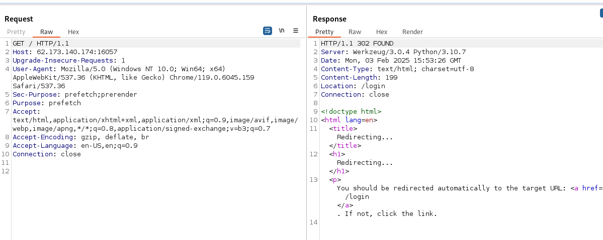

## Bug Bounty-code

#### Решение

Заходим на веб-сервис, в первую очередь смотрим заголовки ответа.



Видим заголовок от сервера ```Server: Werkzeug/3.0.4 Python/3.10.7```, который явно указывает об отсуствии реверс прокси, а также что приклад написан на python фреймворке. Также ответ HTTP 302 с редиретором на ```Location: /login```.


Изучаем страницу регистрации. Пробуем зарегистрировать несколько пользователей, для попыток детекта каких-то уязвимостей